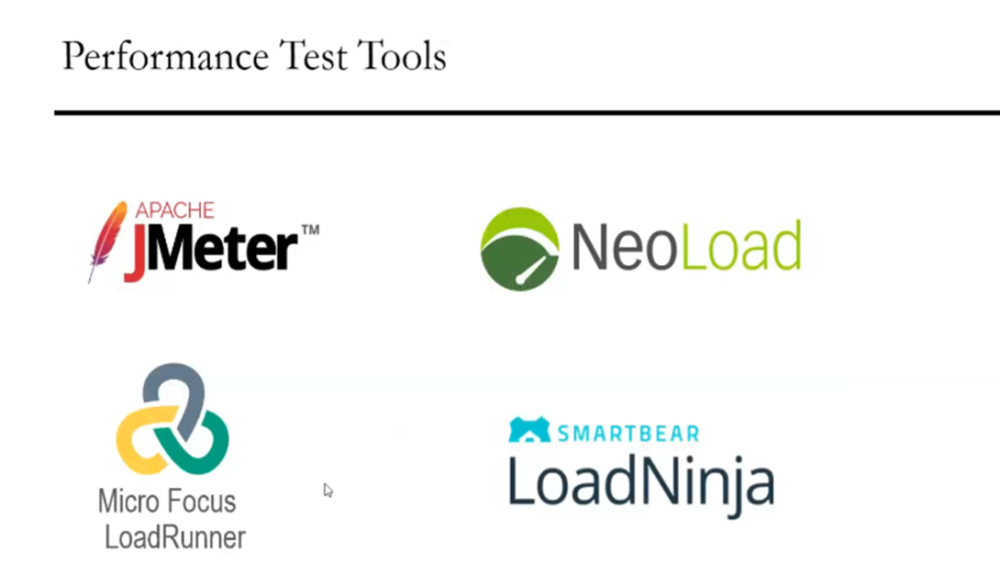

# Section-1 Introduction
# 1. Overview


## Performance Testing process

```
So it can help demonstrate that your software system meets certain predefined performance criteria,
or it can help compare the performance of two systems, two software systems.
So it can also help identify parts of your software system which degrade its performance.
So here a generic process on how to perform a performance testing.
So this is a common generic process.
```
### A . Identifying Test Environment
```
So first one is identify the test environment.
So first of all, we need to know your physical test, environment, production, environment and what
testing tools are available.
So understand details of the hardware, software and network configurations used during testing before
you begin the testing process.
So it will help testers create more efficient tests.
It will also help identify possible challenges that testers may encounter during the performance testing
procedures.
```
### B. So the next one is plan and design the performance test.
```
So determine how usage is likely to vary amongst end users and identify key scenarios to test for all
possible use cases, it is necessary to simulate a variety of end users, plan performance, test data and outline what metrics will be gathered.
```
### c.) identify performance, accepts acceptance criteria.
```
So basically this includes goals and constraints for throughput response times and resource allocation.
It is also necessary to identify project success criteria outside of these goals and constraints.
So testers should be empowered to set performance criteria and goals because often the project specifications
will not include a wide enough or a wide enough variety of performance benchmarks.
So sometimes there may be none at all.
So when possible, finding a similar application to compare to is a good way to set performance goal.
```
### d)  configure test environment.
```
So we need to prepare the testing environment before execution.
So also arrange tools and other resources.
```
### e) implement test design.
```
So it creates the first we need to create the performance test according to your test design.
So again, test design will be created based upon the performance requirements 
```
### f) execute test.
So here we need to execute a performance test cases, and then we need to monitor the test and finally
### G)analyze and report.
And here we need to analyze and share the test results then.
```
So then fine tune and test again.
Test again to see if there are any improvement or decrease in performance.
So since improvements generally grows smaller with each retest because we need to do sometimes retesting
and tuning analyzing here.

And since improvements generally grows smaller with each retest, so stop when bottlenecking is caused
by the CPU.
So then you may have the consider option of increasing CPU power.
So this is all about the performance testing process.
```
## Performance Testing metric

- So these are the common parameters which we need to monitor when you are doing performance testing.
## EG

```
3rd Point – here we do Stress testing
4rth point – Comes under Endurance testing
5th point – Comes under Load testing
6th point – Comes under  Spike testing
```
## 

So Jmeter and micro focus Loadrunner is becomes very popular tools currently in the market in the nowadays
## Conclusion
```
Now, the conclusion is in software engineering, performance testing is necessary before marketing

any software product, so it ensures customer satisfaction and products and investors investment against

product failure.

So cost of performance testings are usually more than made up for with improved customer satisfaction,

loyalty and retention.
```
# 2. Introduction and Usage of Jmeter

```
So Jmeter is a basically a performance testing tool and it is purely Java based software or Java based application and which we can easily download and install on any other operating system.
So it supports multiple platforms and basically Jmeter is used for performance testing.
So that means we can test the web applications performance irrespective of load as well as stress volume.
And also we can use Jmeter for web services or testing of web based applications.
And also sometimes we can also use Jmeter for database server testing.
So this is a basic introduction about Jmeter 
```

```
Visualize Test Result == So visualize the test results so test results can be displayed in different format, such as charts and tables on three format on log files.
So we can see different kinds of reports.

Support multi protocol 
 Then simulation so Jmeter can simulate multiple users with concurrent threads.
So create a heavy load against web application under test so it supports multiple protocols like Jmeter does not allow or doesn't, does not only support web application testing, but also it evaluates database server performance and API testing.
So all basic protocols such as Http, Jdbc, Ldap, soap and FTP are supported by Jmeter.
```

```
So the Jmeter simulates a group of users sending requests to the target server and returns a statistics information of target server through graphical diagram.
So in this particular diagram you can clearly see the complete workflow of Jmeter.
So basically it will create a request to the target server.
Then it will get server will response with all the statistics or information.
Then it saves all the responses.
Then it will collect those responses and calculate the static statistical information.
Then accordingly it will generate the test reports.
So this is how the Jmeter works internally 
```

# Section-2 Jmeter Installation on windows and mac.
# Section-3 Jmeter Elemets and First Jmeter Test
# 5. Jmeter Element (Thread, Group, Samplers, Listeners and configuration)

```
Thread group is one of the elements, 
Under Thread Group We have a samplers, logic controllers, listeners, configuration element assertions, timers and so on.
 these are all called different type of elements.
Again, in each and every element.
Again, we can have lot of sub elements, so every element is having their own purpose.
```

```
Suppose if you see this particular picture, so thread group so contains multiple threads, so every thread is representing one user and every user can send a request and get the response.
So this will be simulated by using thread group.
```

```
So here we discussed about thread group.
So every user is comes under one thread or in other words, we can say every thread is simulate a user request,
     but what kind of request they have to send.
So samplers are a different type of request which are sent by the thread group.
So the user request could be either FTP request or it can be Http request, Jdbc request and etc.
So all these requests comes under samplers.
So FTP request, http request, Jdbc, BSF access log and Smtp and so on.
There are multiple type of requests we have in Jmeter supported and all these comes under samplers.
```

```
So basically this configuration element is used for setting the default variables which we can use by samplers.

So the samplers, again, we specify the URLs or data sets.
So all these things are common variables which are required for all kinds of samplers will be configured in configuration.

So for example, CSV data set config, http cookie manager login config element and then http request  default http request defaults.
So these are all the different type of configuration elements we have.
```

```
Threadgroup representing the number of users.

Samplers are representing the type of requests the users should send.

Listeners are representing the reports.
Basically it will generate the reports in graph format, tabular format, log format and so on, and

configuration elements representing the specifying the common variables which are used in samplers.
```
# 6. First Jmeter Test

So the test plan is a container which contains a lot of things, like all the elements of Jmeter will be created here under test plan and the entire project is also saved as part of test plan.

For New Test plan  File then New 

So how many users want to perform a test so that we need to define so under thread users you can see thread group.
So thread group is representing number of users. 
So select this thread group.

Now here we can also rename this one thread group or if you want to have the same thing, you can just have like this.

And here there are multiple actions to be taken after sampler error. So if there is any error rating so we can just perform a post action here.

number of threads means users. How many number of users should perform this particular test?

So suppose if I say three here, so every user, first user send a request after three seconds again,
second user will send the request again after three seconds, third user will send the request.
So this is basically a time ramp up period of time.

how many times the user should send the request. So that is called loop count.

How many times these same user five users are repeatedly sending the request.
So if I select forever, it will go to keep on sending the request forever.
And if you want to specify the number of loops here, we can just specify the loop, count how many
number of times we have to repeat the same request sent by the number of users.

For now I'm just adding only one user and one second of time and then loop count is just say one here.
And this is a basic important setup.
We need to do this call thread properties and once we have add this, then the next thing is just go to your test plan. (Click on the Test Plan)
Then the users will be created.

```
But after specifying this configuration thread group, what kind of request we have to send so that we need to specify.
So here under users select this add there is a option called sampler.
```

So sampler is nothing but the kind of request we have to send to the server.
So here there are so many types of requests, are there?
There are different type of samplers.
So currently I'm just taking one Http request.

```
You can add some comments 
https://abc.com/
 This is part of http so we replace it with www.abc.com/
In Path / represent home page
```

```
we need  to see the report.
How much time it is taken to hit this website, websites and all.
So for that we need to create one more element that is listeners.
```

- I ALSO  want to print/see the result in tabular data.

                                
